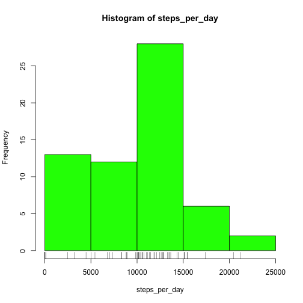
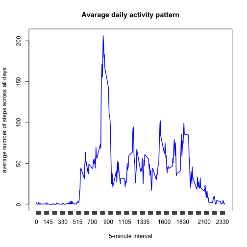
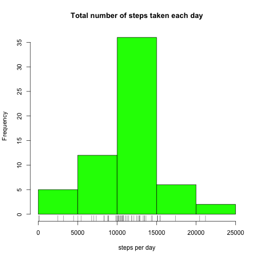
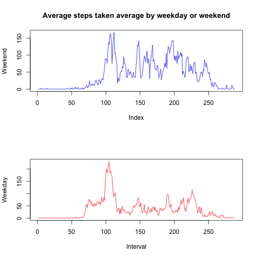

# Reproducible Research: Peer Assessment 1


## Loading and preprocessing the data  

Loading activity.csv into a data frame "monitor"

```r
monitor <- read.csv("activity.csv")
```


Use tapply to get the sum of steps each day.

```r
steps_per_day <- tapply(monitor$steps, monitor$date, sum, na.rm = T)
```


Make a histogram of the total number of steps taken each day

```r
hist(steps_per_day, col = "green", xlab = "steps per day", main = "Total number of steps per day")
rug(steps_per_day)
```

 


Calculate and report the mean and median total number of steps taken per day

```r
mean(steps_per_day)
```

```
## [1] 9354
```

```r
median(steps_per_day)
```

```
## [1] 10395
```


## What is the average daily activity pattern?

Split steps by intervals, then use sapply to get the average of steps each interval.

```r
steps_per_interval <- sapply(with(monitor, split(steps, interval)), mean, na.rm = TRUE)
```


Make a time series plot of the 5-min intervals and the average number of steps taken, averages across all days.

```r
plot(as.table(steps_per_interval), type = "l", col = "blue", xlab = "5-minute interval", 
    ylab = "average number of steps across all days", main = "Avarage daily activity pattern")
```

 


Which 5-min interval, on average across all the days in the dataset, contains the maximum number of steps?

```r
which(steps_per_interval == max(steps_per_interval))
```

```
## 835 
## 104
```

So the __104^(th) 5-minute interval__, i.e. __835__, contains the maximum number of steps.

## Imputing missing values
Calculate and report the total number of missing values in the dataset.

```r
sum(is.na(monitor$steps))
```

```
## [1] 2304
```


Devise a strategy for filling in all of the missing values in the dataset.  
_Fill by the mean for 5-min interval_

```r
filler <- rep(steps_per_interval, 61)
steps <- monitor$steps
na <- which(is.na(steps))
steps[na] <- filler[na]
```


Create a new dataset that is equal to the original dataset but with the missing data filled in.

```r
monitor_imputed <- cbind(steps, monitor[, c(2, 3)])
```


Make a histogram of the total number of steps taken each day.

```r
steps_date_rm_na <- sapply(with(monitor_imputed, split(steps, date)), sum)
hist(steps_date_rm_na, col = "green", main = "Total number of steps taken each day", 
    xlab = "steps per day")
rug(steps_date_rm_na)
```

 


Calculate and report the mean and median total number of steps taken each day

```r
mean(steps_date_rm_na)
```

```
## [1] 10766
```

```r
median(steps_date_rm_na)
```

```
## [1] 10766
```


## Are there differences in activity patterns between weekdays and weekends?
Use strptime() to convert date into POSIXlt

```r
date <- monitor_imputed$date
date <- strptime(date, "%Y-%m-%d")
```


Create a new factor variable in the dataset with two levels - "weekday" and "weekend" indicating whether a given date is a weekday or weekend day.

```r
week <- weekdays(date)
week[week %in% c("Monday", "Tuesday", "Wednesday", "Thursday", "Friday")] <- "weekday"
week[week %in% c("Saturday", "Sunday")] <- "weekend"
week <- factor(week)
plotdata <- cbind(monitor_imputed[c(1, 3)], week)
```


Make a panel plot containing a time series plot of the 5-min intervals and the average number of steps taken, averaged across all weekday days and weekend days.


```r
steps_weekday <- sapply(with(plotdata[week == "weekday", ], split(steps, interval)), 
    mean)
steps_weekend <- sapply(with(plotdata[week == "weekend", ], split(steps, interval)), 
    mean)
par(mfrow = c(2, 1))
plot(steps_weekend, type = "l", col = "blue", main = "Average steps taken average by weekday or weekend", 
    ylab = "Weekend")
plot(steps_weekday, type = "l", col = "red", xlab = "Interval", ylab = "Weekday")
```

 

